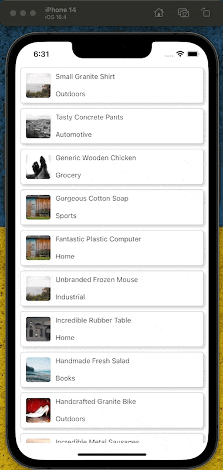

# Animated Collapsible Card with React Native Reanimated

<div align="center">
  <a align="center" href="https://github.com/dimaportenko?tab=followers">
    
  </a>
  <br/>
  <a align="center" href="https://twitter.com/dimaportenko">
    
  </a>
  <br/>
  <a align="center" href="https://www.youtube.com/channel/UCReKeeIMZywvQoaZPZKzQbQ">
    
  </a>
  <br/>
  <a align="center" href="https://www.youtube.com/channel/UCReKeeIMZywvQoaZPZKzQbQ">
    
  </a>
</div>
<br/>

In this tutorial, we'll create an animated collapsable card using `react-native-reanimated`. We'll be starting from a provided template, which can be found at [this GitHub link](https://github.com/dimaportenko/reanimated-collapsable-card-tutorial/tree/template). The template contains an Expo project with a FlatList. Each list item has an image, title, and description. Our goal is to make the description collapsable with a smooth animation.



## Getting Started

First, clone the project from GitHub and switch to the `template` branch:

```
git clone https://github.com/dimaportenko/reanimated-collapsable-card-tutorial.git
cd reanimated-collapsable-card-tutorial
git checkout template
```

### Adding React Native Reanimated

We will be using the `react-native-reanimated` library to create our animations. To add it, run the following command:

```
npx expo install react-native-reanimated
```

Then, you'll need to update your `babel.config.js`:

```jsx
module.exports = function (api) {
  api.cache(true);
  return {
    presets: ['babel-preset-expo'],
    plugins: ['react-native-reanimated/plugin'],
  };
};
```

### Implementation

In our `ListItem.tsx`, we will add a new state for the height of the collapsable content:

```jsx
const [height, setHeight] = useState(0);
const animatedHeight = useSharedValue(0);
```

We calculate the collapsible content height in the `onLayout` callback:

```jsx
const onLayout = (event: LayoutChangeEvent) => {
  const onLayoutHeight = event.nativeEvent.layout.height;

  if (onLayoutHeight > 0 && height !== onLayoutHeight) {
    setHeight(onLayoutHeight);
  }
};
```

We'll create an animated style for our collapsable content:

```jsx
const collapsableStyle = useAnimatedStyle(() => {
  animatedHeight.value = expanded ? withTiming(height) : withTiming(0);

  return {
    height: animatedHeight.value,
  };
}, [expanded]);
```

We'll wrap our collapsable content in an `Animated.View`:

```jsx
<Animated.View style={[collapsableStyle, {overflow: 'hidden'}]}>
  <View style={{ position: 'absolute'  }} onLayout={onLayout}>
    <Text style={[styles.details, styles.text]}>{item.details}</Text>
  </View>
</Animated.View>
```

To make our code more maintainable, let's refactor the `CollapsableContainer` into a separate reusable component:

```jsx
import React, { useState } from "react";
import { LayoutChangeEvent, View, Text } from "react-native";
import Animated, {
  useAnimatedStyle,
  useSharedValue,
  withTiming,
} from "react-native-reanimated";

export const CollapsableContainer = ({
  children,
  expanded,
}: {
  children: React.ReactNode;
  expanded: boolean;
}) => {
  const [height, setHeight] = useState(0);
  const animatedHeight = useSharedValue(0);

  const onLayout = (event: LayoutChangeEvent) => {
    const onLayoutHeight = event.nativeEvent.layout.height;

    if (onLayoutHeight > 0 && height !== onLayoutHeight) {
      setHeight(onLayoutHeight);
    }
  };

  const collapsableStyle = useAnimatedStyle(() => {
    animatedHeight.value = expanded ? withTiming(height) : withTiming(0);

    return {
      height: animatedHeight.value,
    };
  }, [expanded]);

  return (
    <Animated.View style={[collapsableStyle, { overflow: "hidden" }]}>
      <View style={{ position: "absolute" }} onLayout={onLayout}>
        {children}
      </View>
    </Animated.View>
  );
};
```

Then, we can use our new `CollapsableContainer` component in the `ListItem` component:

```jsx
export const ListItem = ({ item }: { item: ListItemType }) => {
  const [expanded, setExpanded] = useState(false);

  const onItemPress = () => {
    setExpanded(!expanded);
  };

  return (
    <View style={styles.wrap}>
      <TouchableWithoutFeedback onPress={onItemPress}>
        <View style={styles.container}>
          <Image source={{ uri: item.image }} style={styles.image} />
          <View style={styles.textContainer}>
            <Text style={styles.text}>{item.title}</Text>
            <Text style={styles.text}>{item.subtitle}</Text>
          </View>
        </View>
      </TouchableWithoutFeedback>
      <CollapsableContainer expanded={expanded}>
        <Text style={[styles.details, styles.text]}>{item.details}</Text>
      </CollapsableContainer>
    </View>
  );
};
```

That's it! You have successfully created an animated collapsable card in React Native using `react-native-reanimated`. This animated component provides a smooth user experience, and the separate `CollapsableContainer` component can be reused in different parts of your application. Happy coding!

---
